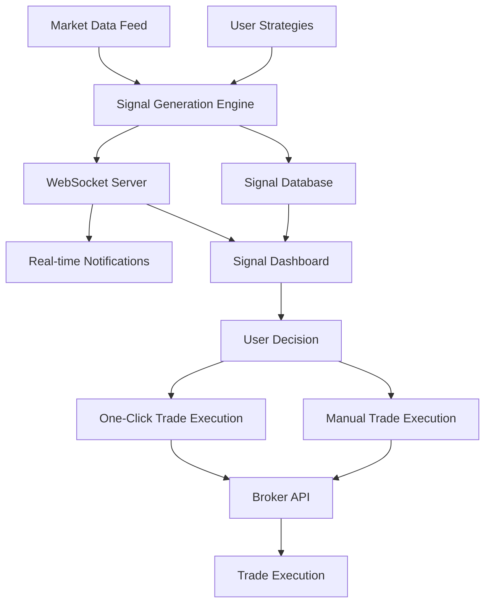

# Trade Signal System Architecture Plan

## Overview
Transform the existing automated trading bot into a trade signal/alert system that:
- Generates real-time alerts when strategies detect entry opportunities (buy/sell signals)
- Provides periodic trade suggestions based on strategy analysis
- Shows detailed analysis/reasoning behind each signal
- Displays signals in the dashboard with notifications
- Allows users to execute trades from signals (one-click or manual)
- **WebSocket support for real-time signal updates without polling**

## Current System Analysis

### Existing Components
- **Strategy Runner**: Executes user-defined strategies in a sandboxed VM
- **Broker Connection**: TradeLocker integration for market data and order execution
- **Database**: PostgreSQL with tables for strategies, trades, risk configs, logs, backtests
- **Client UI**: Dashboard, Strategy Editor, Risk Settings, etc.

### Current Limitations
- Strategy runner only places orders automatically (or in dry-run mode)
- No signal storage or history
- No detailed analysis/reasoning captured
- No periodic suggestion generation
- Limited to XAUUSD quotes

## New Architecture Design

### System Flow



### Core Components

#### 1. Signal Generation Engine
**Location**: `server/signal-engine.ts` (new file)

**Responsibilities**:
- Continuously monitor market data for configured symbols
- Execute user strategies to detect entry opportunities
- Generate signals with detailed analysis
- Support both real-time and periodic modes

**Key Functions**:
```typescript
interface SignalEngine {
  // Start monitoring with strategies
  start(strategies: Strategy[], options: EngineOptions): void;
  
  // Stop monitoring
  stop(): void;
  
  // Get current status
  status(): EngineStatus;
}

interface EngineOptions {
  mode: 'realtime' | 'periodic';
  intervalMs?: number; // For periodic mode
  symbols: string[]; // Symbols to monitor
  dryRun?: boolean;
}

interface Signal {
  id: string;
  userId: string;
  strategyId: string;
  strategyName: string;
  symbol: string;
  direction: 'buy' | 'sell';
  entryPrice: number;
  stopLoss?: number;
  takeProfit?: number;
  confidence: number; // 0-100
  reasoning: string; // Detailed analysis
  indicators: IndicatorData[]; // Technical indicators used
  timestamp: Date;
  status: 'pending' | 'viewed' | 'executed' | 'dismissed' | 'expired';
  executedAt?: Date;
  expiresAt?: Date;
}
```

#### 2. Signal Database Schema
**Location**: `shared/schema.ts` (update)

**New Tables**:

```typescript
// Trade signals generated by strategies
export const tradeSignals = pgTable("trade_signals", {
  id: varchar("id").primaryKey().default(sql`gen_random_uuid()`),
  userId: varchar("user_id").notNull().references(() => users.id),
  strategyId: varchar("strategy_id").notNull().references(() => strategies.id),
  strategyName: text("strategy_name").notNull(),
  symbol: text("symbol").notNull(),
  direction: text("direction").notNull(), // 'buy' or 'sell'
  entryPrice: numeric("entry_price").notNull(),
  stopLoss: numeric("stop_loss"),
  takeProfit: numeric("take_profit"),
  confidence: integer("confidence").notNull(), // 0-100
  reasoning: text("reasoning").notNull(), // Detailed analysis
  indicators: jsonb("indicators"), // Technical indicator data
  timeframe: text("timeframe").notNull(),
  timestamp: timestamp("timestamp").notNull().default(sql`now()`),
  status: text("status").notNull().default('pending'), // pending, viewed, executed, dismissed, expired
  viewedAt: timestamp("viewed_at"),
  executedAt: timestamp("executed_at"),
  expiresAt: timestamp("expires_at"),
  orderId: text("order_id"), // Link to executed order
  pnl: numeric("pnl"), // Result if executed
});

// Signal statistics for analytics
export const signalStats = pgTable("signal_stats", {
  id: varchar("id").primaryKey().default(sql`gen_random_uuid()`),
  userId: varchar("user_id").notNull().references(() => users.id),
  strategyId: varchar("strategy_id").references(() => strategies.id),
  date: date("date").notNull(),
  totalSignals: integer("total_signals").notNull(),
  executedSignals: integer("executed_signals").notNull(),
  winningSignals: integer("winning_signals").notNull(),
  avgConfidence: numeric("avg_confidence"),
  totalPnl: numeric("total_pnl"),
});
```

#### 3. API Endpoints
**Location**: `server/routes.ts` (update)

**New Routes**:

```
GET  /api/signals              - List all signals for user
GET  /api/signals/:id          - Get specific signal details
POST /api/signals/:id/execute  - Execute trade from signal
POST /api/signals/:id/dismiss  - Dismiss signal
POST /api/signals/:id/view     - Mark signal as viewed
GET  /api/signals/stats        - Get signal statistics
POST /api/signals/manual       - Create manual signal
```

#### 4. Client UI Components
**Location**: New files in `client/src/components/signals/`

**Components**:

1. **SignalPanel** - Main signals display
   - Shows active/pending signals
   - Real-time updates via polling or WebSocket
   - Signal cards with key info

2. **SignalCard** - Individual signal display
   - Symbol, direction, entry price
   - Confidence indicator
   - Expandable reasoning/analysis
   - Execute/Dismiss buttons
   - One-click trade button

3. **SignalHistory** - Historical signals
   - Filterable by status, symbol, strategy
   - Performance metrics
   - Export functionality

4. **SignalAnalytics** - Statistics dashboard
   - Win rate by strategy
   - Average confidence
   - PnL tracking
   - Signal frequency charts

5. **SignalNotifications** - Toast/alert system
   - Real-time signal notifications
   - Sound alerts (optional)
   - Browser notifications

#### 5. WebSocket Server
**Location**: `server/websocket.ts` (new file)

**Responsibilities**:
- Manage WebSocket connections from clients
- Broadcast new signals to connected clients
- Handle client subscriptions (specific symbols, strategies)
- Send real-time updates for signal status changes

**Key Functions**:
```typescript
interface WebSocketServer {
  // Initialize WebSocket server
  initialize(server: http.Server): void;
  
  // Broadcast signal to all connected clients
  broadcastSignal(signal: Signal): void;
  
  // Broadcast signal update to specific clients
  broadcastSignalUpdate(signalId: string, update: Partial<Signal>): void;
  
  // Send market data updates
  broadcastMarketData(symbols: string[]): void;
  
  // Handle client subscription
  handleSubscription(clientId: string, subscription: Subscription): void;
}

interface Subscription {
  type: 'signals' | 'market' | 'all';
  symbols?: string[];
  strategies?: string[];
}
```

#### 6. Strategy Context Enhancement
**Location**: `server/strategy-runner.ts` (update)

**Enhanced Strategy Context**:

```typescript
interface StrategyContext {
  quotes: Record<string, QuoteData>;
  candles: Record<string, CandleData[]>; // Historical candles
  indicators: {
    sma: (period: number) => number[];
    ema: (period: number) => number[];
    rsi: (period: number) => number;
    macd: () => { macd: number; signal: number; histogram: number };
    bb: (period: number, stdDev: number) => { upper: number; middle: number; lower: number };
    atr: (period: number) => number;
    stoch: (kPeriod: number, dPeriod: number, smooth: number) => { k: number; d: number };
    cci: (period: number) => number;
    williamsR: (period: number) => number;
    parabolicSAR: (step: number, max: number) => number;
    ichimoku: () => { tenkan: number; kijun: number; senkouA: number; senkouB: number; chikou: number };
    adx: (period: number) => { adx: number; diPlus: number; diMinus: number };
    momentum: (period: number) => number[];
    fibonacci: (high: number, low: number) => { levels: number[]; retracements: Record<string, number> };
    pivotPoints: () => { r3: number; r2: number; r1: number; pivot: number; s1: number; s2: number; s3: number };
  };
  account: BrokerCredential;
  riskConfig: RiskConfig | undefined;
  log: { info: (msg: string) => void; error: (msg: string) => void };
  generateSignal: (signal: Omit<Signal, 'id' | 'userId' | 'timestamp' | 'status'>) => void;
}
```

#### 7. WebSocket Client
**Location**: `client/src/lib/websocket.ts` (new file)

**Responsibilities**:
- Establish WebSocket connection to server
- Handle incoming signal notifications
- Handle market data updates
- Manage reconnection logic
- Provide hooks for React components

**Key Functions**:
```typescript
interface WebSocketClient {
  connect(): void;
  disconnect(): void;
  onSignal(callback: (signal: Signal) => void): void;
  onSignalUpdate(callback: (update: SignalUpdate) => void): void;
  onMarketData(callback: (data: MarketData) => void): void;
  subscribe(subscription: Subscription): void;
}

// React hook
function useWebSocket(): {
  connected: boolean;
  signals: Signal[];
  marketData: Record<string, QuoteData>;
  subscribe: (sub: Subscription) => void;
};
```

### Implementation Phases

#### Phase 1: Database & Backend Foundation
1. Add `tradeSignals` and `signalStats` tables to schema
2. Create storage methods for signals
3. Implement technical indicators library
4. Implement WebSocket server
5. Add API endpoints for signals

#### Phase 2: Signal Generation
1. Enhance strategy context with indicators
2. Implement signal generation from strategies
3. Add periodic signal generation mode
4. Implement signal expiration logic

#### Phase 3: Client UI - Basic
1. Create SignalPanel component
2. Create SignalCard component
3. Add signals page to navigation
4. Implement signal list view

#### Phase 4: Client UI - Advanced
1. Add signal details/analysis view
2. Implement execute/dismiss actions
3. Add one-click trade execution
4. Create SignalHistory component

#### Phase 5: WebSocket & Real-time Updates
1. Implement WebSocket client connection
2. Add real-time signal notifications via WebSocket
3. Handle market data updates
4. Implement reconnection logic

#### Phase 6: Notifications & Analytics
1. Create SignalAnalytics component
2. Add signal statistics tracking
3. Implement export functionality
4. Add browser notifications support

#### Phase 6: Polish & Testing
1. Add comprehensive error handling
2. Implement signal filtering/sorting
3. Add user preferences (notification settings)
4. End-to-end testing

### Key Design Decisions

1. **Signal Storage**: All signals stored in database for history and analytics
2. **Signal Expiration**: Signals expire after configurable time (default 1 hour)
3. **Confidence Scoring**: Strategies should provide confidence (0-100) for each signal
4. **Indicators**: Built-in technical indicators available to strategies
5. **Multi-Symbol Support**: Monitor multiple symbols simultaneously
6. **Dual Mode**: Support both real-time (on tick) and periodic (interval) signal generation

### File Structure Changes

```
server/
├── signal-engine.ts          (NEW)
├── signal-notifier.ts        (NEW)
├── websocket.ts              (NEW)
├── indicators.ts             (NEW)
├── routes.ts                 (UPDATE - add signal routes)
└── strategy-runner.ts        (UPDATE - enhance context)

shared/
└── schema.ts                 (UPDATE - add signal tables)

client/
├── src/
│   ├── pages/
│   │   └── SignalsPage.tsx   (NEW)
│   ├── components/
│   │   ├── signals/
│   │   │   ├── SignalPanel.tsx       (NEW)
│   │   │   ├── SignalCard.tsx        (NEW)
│   │   │   ├── SignalDetails.tsx     (NEW)
│   │   │   ├── SignalHistory.tsx     (NEW)
│   │   │   └── SignalAnalytics.tsx   (NEW)
│   │   └── trading/
│   │       └── Sidebar.tsx           (UPDATE - add signals link)
│   └── lib/
│       ├── api.ts                    (UPDATE - add signal API calls)
│       └── websocket.ts              (NEW)
```

### Database Migration

```sql
-- Create trade_signals table
CREATE TABLE trade_signals (
  id VARCHAR PRIMARY KEY DEFAULT gen_random_uuid(),
  user_id VARCHAR NOT NULL REFERENCES users(id),
  strategy_id VARCHAR NOT NULL REFERENCES strategies(id),
  strategy_name TEXT NOT NULL,
  symbol TEXT NOT NULL,
  direction TEXT NOT NULL CHECK (direction IN ('buy', 'sell')),
  entry_price NUMERIC NOT NULL,
  stop_loss NUMERIC,
  take_profit NUMERIC,
  confidence INTEGER NOT NULL CHECK (confidence >= 0 AND confidence <= 100),
  reasoning TEXT NOT NULL,
  indicators JSONB,
  timeframe TEXT NOT NULL,
  timestamp TIMESTAMP NOT NULL DEFAULT now(),
  status TEXT NOT NULL DEFAULT 'pending' CHECK (status IN ('pending', 'viewed', 'executed', 'dismissed', 'expired')),
  viewed_at TIMESTAMP,
  executed_at TIMESTAMP,
  expires_at TIMESTAMP,
  order_id TEXT,
  pnl NUMERIC
);

-- Create index for faster queries
CREATE INDEX idx_signals_user ON trade_signals(user_id, timestamp DESC);
CREATE INDEX idx_signals_status ON trade_signals(status);
CREATE INDEX idx_signals_symbol ON trade_signals(symbol);

-- Create signal_stats table
CREATE TABLE signal_stats (
  id VARCHAR PRIMARY KEY DEFAULT gen_random_uuid(),
  user_id VARCHAR NOT NULL REFERENCES users(id),
  strategy_id VARCHAR REFERENCES strategies(id),
  date DATE NOT NULL,
  total_signals INTEGER NOT NULL,
  executed_signals INTEGER NOT NULL,
  winning_signals INTEGER NOT NULL,
  avg_confidence NUMERIC,
  total_pnl NUMERIC
);

-- Create unique constraint
CREATE UNIQUE INDEX idx_stats_user_strategy_date ON signal_stats(user_id, COALESCE(strategy_id, ''), date);
```

### WebSocket Message Protocol

#### Client → Server Messages
```typescript
// Subscribe to updates
{ type: 'subscribe', payload: { symbols?: string[], strategies?: string[] } }

// Unsubscribe
{ type: 'unsubscribe', payload: { symbols?: string[], strategies?: string[] } }

// Heartbeat/ping
{ type: 'ping' }
```

#### Server → Client Messages
```typescript
// New signal
{ type: 'signal', payload: Signal }

// Signal update
{ type: 'signal_update', payload: { id: string, changes: Partial<Signal> } }

// Market data update
{ type: 'market_data', payload: { symbol: string, bid: number, ask: number, timestamp: number } }

// Pong response
{ type: 'pong' }

// Error
{ type: 'error', payload: { message: string } }
```

### Next Steps

1. Review and approve this architecture plan
2. Begin implementation with Phase 1 (Database & Backend Foundation)
3. Implement WebSocket server and client in Phase 5
